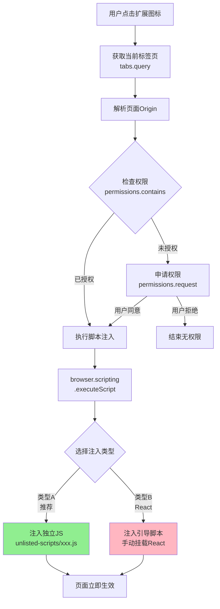

# Prompt Flow 功能清单

> 最后更新于 2026-03-06

---

## 🟢 待办（体验优化）

### 1. UI/UX 改进

**可改进项**：
- [ ] 拖拽排序 prompt 或文件夹
- [ ] 批量操作（批量删除、批量添加标签）
- [ ] Tag 可以置顶（常用 Tag 快速访问）

### 2. 键盘快捷键支持

**文件**：`entrypoints/background.ts`

**需求**：
- [ ] 用户可自定义快捷键配置
- [ ] 快捷键冲突检测与提示

### 3. VariableFillerModal 预览区支持直接编辑

**文件**：`entrypoints/options/components/Modals/VariableFillerModal.tsx:150-154`

**需求**：
- [ ] 预览区域从只读改为可编辑（`pre` 标签改为 `textarea` 或 `contentEditable`）

### 4. Popup 权限检测与 Content Script 注入

**文件**：`entrypoints/popup/App.tsx`, `entrypoints/background.ts`

**需求**：
- [ ] 用户点击 popup 时检测当前网站是否有权限注入 content script
- [ ] 如果没有权限，显示授权提示并引导用户授权
- [ ] 授权成功后自动注入 content script
- [ ] Popup 中增加"打开 Prompt Picker"按钮，点击后注入并打开 content script

**流程图**:


**技术方案**：
```typescript
// 检测权限
const hasPermission = await browser.permissions.contains({
  origins: [currentUrl]
});

// 请求权限
await browser.permissions.request({
  origins: [currentUrl]
});

// 手动注入 content script
await browser.scripting.executeScript({
  target: { tabId: tab.id },
  files: ['content-scripts/content.js']
});
```

## ✅ 已完成（归档）

<details>
<summary>点击展开已完成的 10 项功能</summary>

### 高优先级
1. **Content Script** - 网页端 FloatingPopup 注入 (`content.ts`)
2. **Background Script** - 核心服务逻辑 (`background.ts`)

### 中优先级
3. **Topbar 搜索框** - 实时搜索、下拉列表、键盘导航
4. **Sidebar 标签过滤** - 标签点击过滤、高亮选中
5. **Prompt 版本历史** - 限制 20 个版本、支持删除特定版本
6. **数据导入导出** - 合并模式、去重策略、预览、确认对话框

### 低优先级
7. **数据持久化优化** - 数据结构版本号（v2）
8. **UI/UX** - 深色模式切换闪烁问题修复
9. **提示词使用统计** - useCount、lastUsedAt、Recently Used / Most Used 列表
10. **主题切换样式修复** - Tailwind v4 添加 `@custom-variant dark` 配置

### 2026-03-05 至 2026-03-06 完成
11. **Content Script 交互优化** - 点击外部关闭弹窗、Toast 提示
12. **组件重构** - TagSelector 提取为独立组件
13. **i18n 文案补全** - VariableFillerModal 国际化
14. **Dashboard 统计项优化** - 点击直接打开 VariableFillerModal
15. **Sidebar Logo 更新** - 替换为 SVG 图标
16. **Content Script 匹配模式优化** - 默认仅匹配主流 AI 网站
17. **Popup Logo 更新** - 替换为 SVG 图标

</details>
